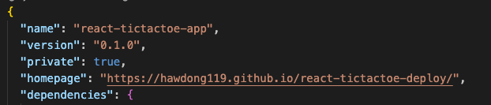
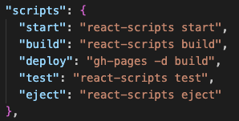

# git 배포
https://hwadong119.github.io/react-tictactoe-deploy/

### 1. gh-pages 모듈 설치
```git
npm install gh-pages --save-dev
```

### 2. package.json에 홈페이지 url 작성

```json
 "homepage": "https://hawdong119.github.io/react-tictactoe-deploy/",
```


### 3. 배포를 위한 script 추가
```json
"deploy": "gh-pages -d build",
```


### 4. Build
```git
npm run build
```

### 5. Deploy
```git
npm run deploy
```

<br>

## Page

Repository -> Setting -> Pages